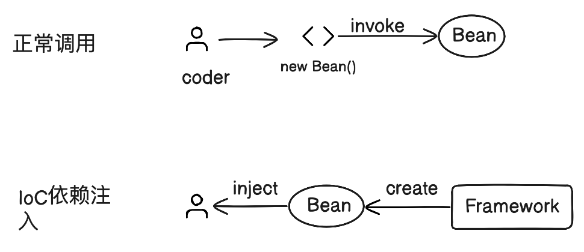

### 什么是IoC


如图，一个“正常”的调用过程是由调用者创建Bean，进行调用IoC则是由框架创建对象注入给调用者。

### DI(Dependency Injection)和IoC(Inversion of Control)的关系

通过上边概念的理解，那么DI依赖注入和IoC的关系就很好区别了，IoC控制反转是通过DI依赖注入的方式实现的。所以说Matin Fowler 引入了依赖注入（DI）来更名IoC。

### Spring三种属性注入的方式
**Field注入，Setter注入， 构造器（Constructor）注入**

1. Field 注入是指我们给 Bean 里面某个变量赋值。
2. Setter 注入是提供了一个 setter 方法，调用 setXXX() 来注入值。
3. constructor 就是在构造器 / 构造函数里传入参数来进行注入。

#### xml配置声明Setter注入
```xml
<beans>
    <bean id="aservice" class="com.minis.test.AServiceImpl">
        <property type="String" name="property1" value="Hello World!"/>
    </bean>
</beans>
```
> 标签下引入了 标签，它又包含了 type、name 和 value，分别对应属性类型、属性名称以及赋值。你可以看一下这个 Bean 的代码。

对应java代码

```java
public class AServiceImpl {
    private String property1;

    public void setProperty1(String property1) {
        this.property1 = property1;
    }
}
```

#### 配置声明构造器注入

```xml
<beans>
    <bean id="aservice" class="com.minis.test.AServiceImpl">
        <constructor-arg type="String" name="name" value="abc"/>
        <constructor-arg type="int" name="level" value="3"/>
    </bean>
</beans>
```

> 与 Setter 注入类似，我们只是把 标签换成了 标签。

对应java代码
```java
public class AServiceImpl {
  
  private String name;
  private int level;

  public AServiceImpl(String name, int level) {
    this.name = name;
    this.level = level;
  }
}
```

> 注入操作的本质，就是给Bean的各个属性进行赋值，具体方式取决于实际情况，哪一种更加便捷就选择哪一种，
> 如果构造器注入满足不了对域的赋值，哪就可以和Setter搭配试用

### 依赖注入，如何解决循环依赖
> IoC技术代码核心是通过Java的反射机制调用构造器，以及Setter方法，在调用过程中根据具体类型
> 把属性值作为一个参数赋值进去。这也是所有框架实现IoC时的思路。**反射技术是IoC容器赖以工作的基础。**

如果属性本身是一个Bean，就牵扯到了Bean之间依赖的情况。**如何用Value这样一个简单的值表示某个对象中所有的域**Spring在标签里增加了**ref（引用）属性**记录了需要引用另外一个Bean。如下配置文件：

```xml
<?xml version="1.0" encoding="UTF-8" ?>
<beans>
    <bean id="basebaseservice" class="com.minis.test.BaseBaseService">
        <property type="com.minis.test.AServiceImpl" name="as" ref="aservice" />
    </bean>
    <bean id="aservice" class="com.minis.test.AServiceImpl">
        <constructor-arg type="String" name="name" value="abc"/>
        <constructor-arg type="int" name="level" value="3"/>
        <property type="String" name="property1" value="Someone says"/>
        <property type="String" name="property2" value="Hello World!"/>
        <property type="com.minis.test.BaseService" name="ref1" ref="baseservice"/>
    </bean>
    <bean id="baseservice" class="com.minis.test.BaseService">
        <!--引用了basebaseservice Bean-->
        <property type="com.minis.test.BaseBaseService" name="bbs" ref="basebaseservice" />
    </bean>
</beans>
```

